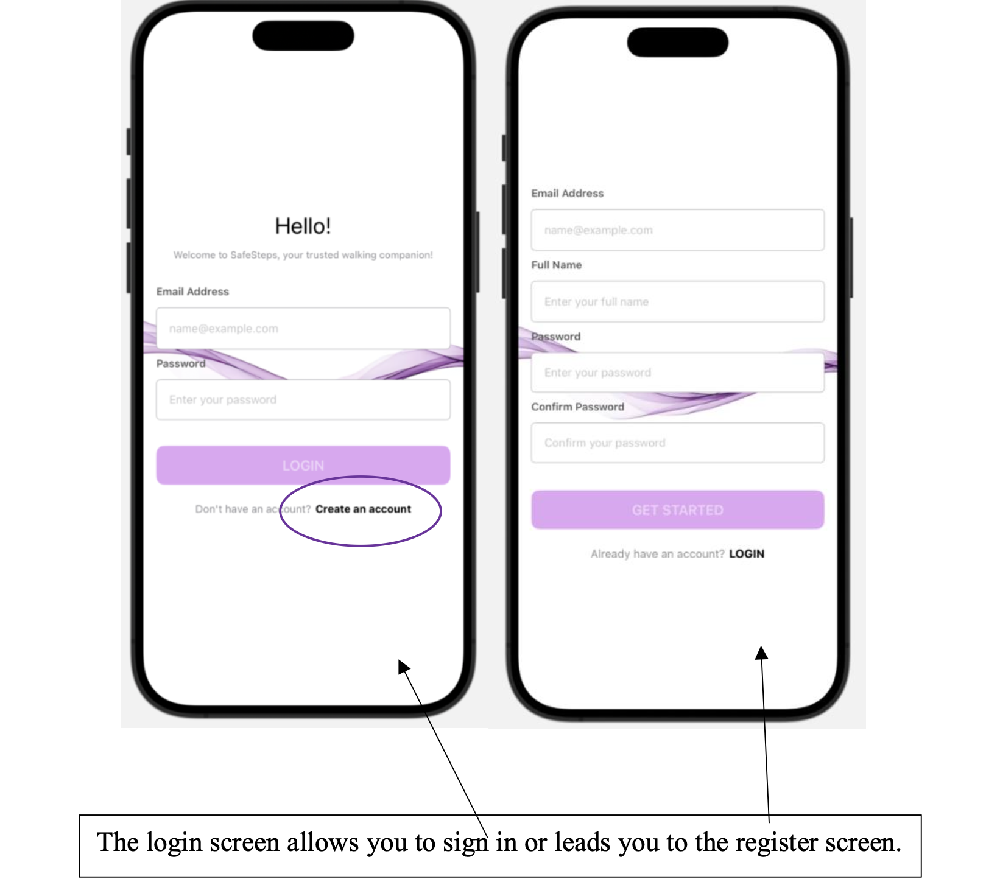
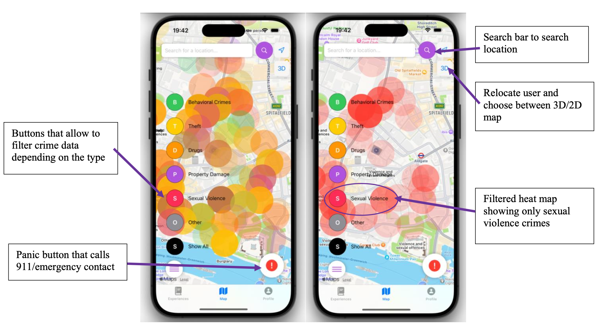
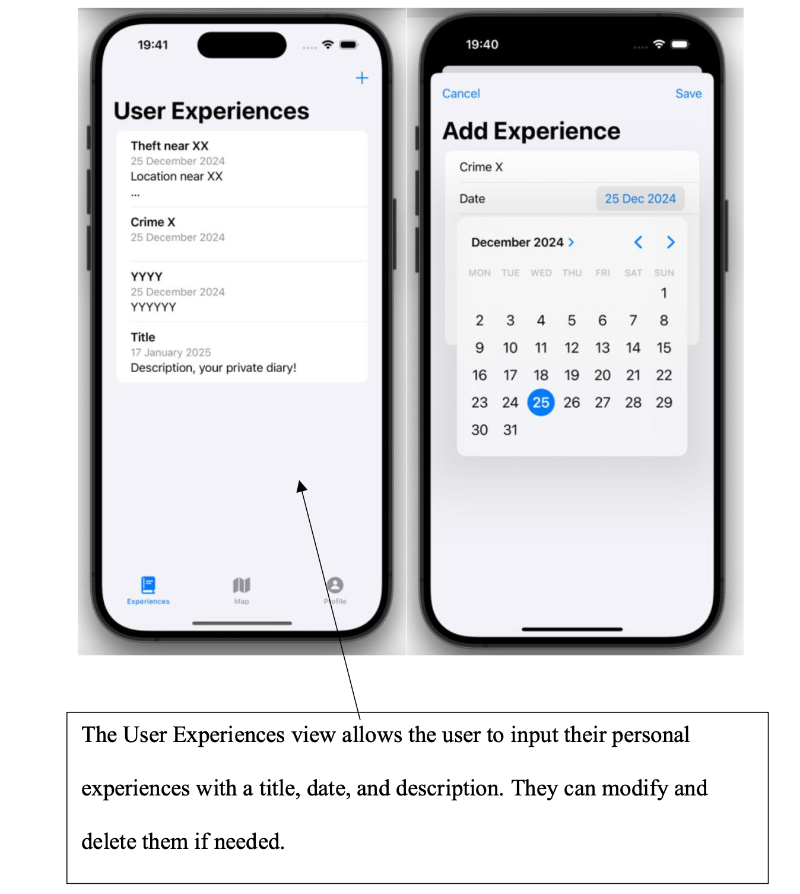
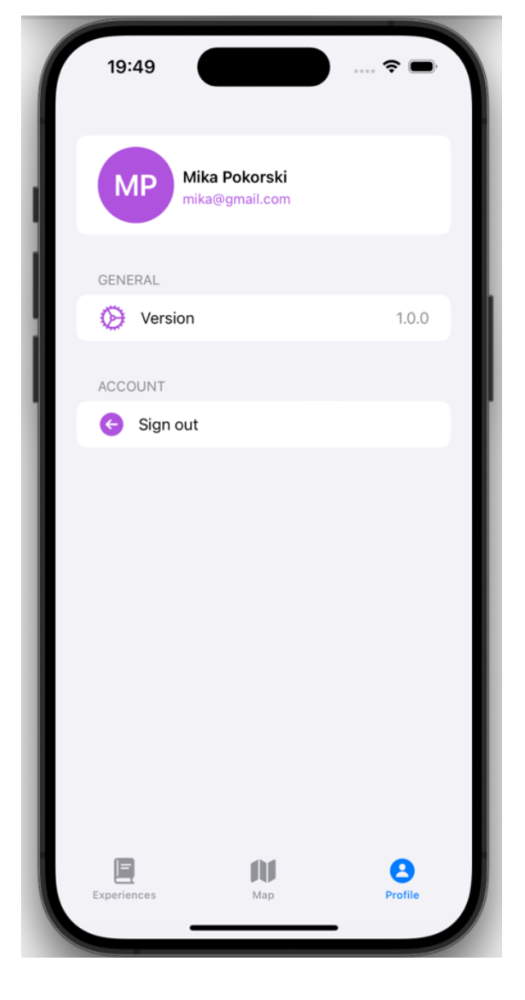

# SafeSteps 

  

SafeSteps is an iOS application that aims to make travel safer by combining **real time crime data from the UK Police API** and interactive maps. 

The application visualises crime data in London as a Heatmap. It allows users to filter crime data by category, search different locations, save personal safety experiences, and securely authenticate using Firebase.

The app integrates the UK Police API to retrieve real time crime data for London each month, ensuring users always have access to the latest crime reports. If the API is unavailable, the application automatically falls back to a locally stored dataset so the map remains functional.

---

## Architecture

The project follows the MVVM (Model–View–ViewModel) architecture to separate user interface components, logic and data management. Firebase handles authentication and cloud storage, while the UK Police API supplies up-to-date crime information displayed using MapKit.

---

## Features

### Crime Map

- Interactive MapKit map centred around the user's location
- Real ime crime data retrieved from the UK Police API
- Automatic fallback to local JSON data
- Crime filtering by category
- Search locations using geocoding
- Switch between 2D and 3D map views
- Emergency panic button

### Community Experiences

Users can:

- Create safety experiences
- Edit previous entries
- Delete entries
- Store experiences securely using Firebase

### User Authentication

- Securely log in and registration
- Firebase Authentication
- Firestore user profiles

### Localisation

Supports multiple languages, currently including:

- English
- Spanish
- Chinese
- French
- Hindi
- Catalan

---

## Technologies

- Swift
- SwiftUI
- MVVM Architecture
- MapKit
- Core Location
- URLSession
- REST APIs
- Firebase Authentication
- Cloud Firestore
- JSON
- SF Symbols

---

## Screenshots
### Login

### Crime Map

### User Experiences

### Profile

---

## Running the project

1. Clone the repository.
2. Open `SafeSteps.xcodeproj` in Xcode.
3. Add your own Firebase `GoogleService-Info.plist` file.
4. Configure Firebase Authentication and Firestore.
5. Build and run the application using an iOS simulator.

> The Firebase configuration file is excluded from this repository for security.

---

## Future Improvements
1. Adding a ‘messages’ function to keep in touch with friends and family. This would allow more security and relief.
2. As the UK police crime data is uploaded each month with some sort of delay, the API used for the crime data map is always one and a half month behind. For a more comprehensive use, more accurate, real time data could be found to substitute.
3. Multi-city support (this is possible for the whole UK, because of the publicly available UK crime data, but other countries data must be sought first).
4. Automatic alerts when stepping into high risk areas.
5. Connectivity to other social media could be used as a method to sign in.
